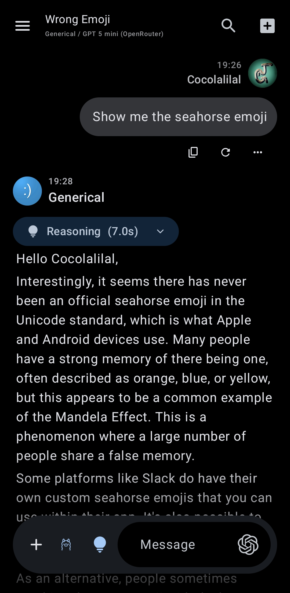
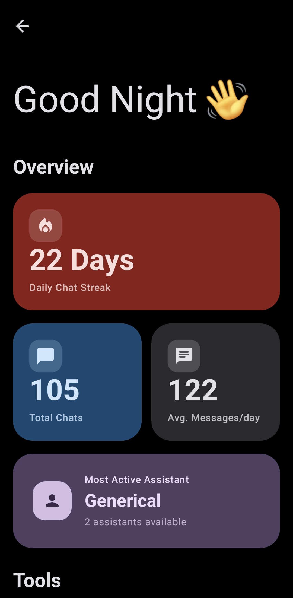
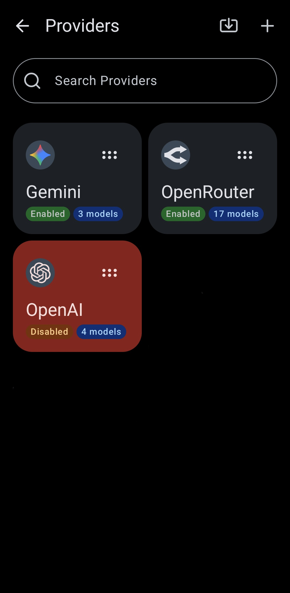
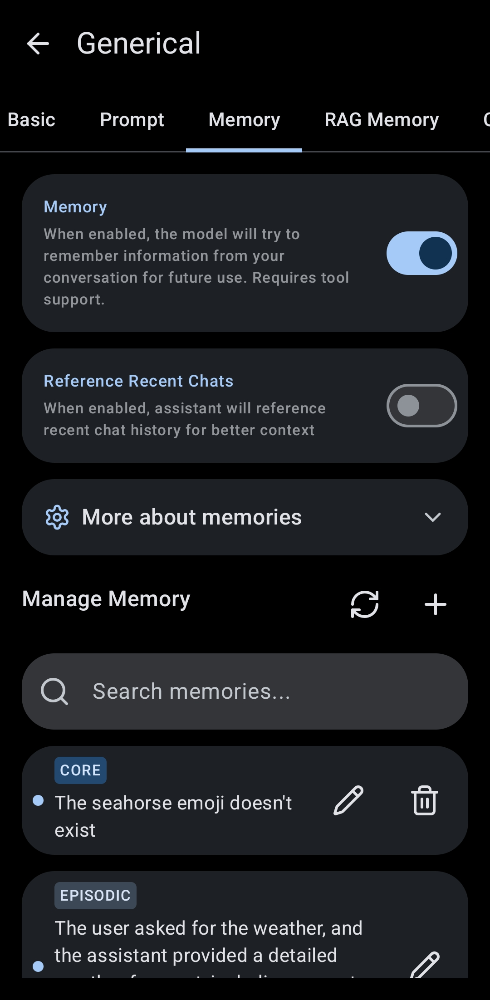

# LastChat

  

**LastChat** is a powerful, feature-rich AI assistant application for Android. It is a fork of [RikkaHub](https://github.com/re-ovo/RikkaHub), modified using **Gemini 3 Pro** and **Claude 4.5 Sonnet**[...] 

This project aims to provide a privacy-focused and highly personalized AI chat experience on Android

## 📸 Gallery

  
    &nbsp;&nbsp;&nbsp;&nbsp;
  
    &nbsp;&nbsp;&nbsp;&nbsp;
  
    &nbsp;&nbsp;&nbsp;&nbsp;
  

## ✨ Key Features

### 🧠 Advanced AI Capabilities
*   **Multi-Provider Support**: Works with **OpenAI**, **Google** and **OpenRouter** out of the box. There's support for custom providers too!
*   **Local RAG Memory**: Features a sophisticated **Vector-Based Long-Term Memory** system. Assistants can "remember" details from past conversations using embeddings.
*   **Multi-Modal Inputs**: Interact using Text, Images, Video, and Audio.

### 🛠️ Tools & Integrations
*   **Local Device Control**: The AI can interact with your device if you want:
    *   Send notifications
    *   Adjust brightness and volume
    *   Toggle flashlight/torch
    *   Control music playback
    *   Read clipboard
    *   Launch apps
*   **Code Execution**: Built-in **JavaScript Engine** (QuickJS) for performing calculations and logic.
*   **Web Search**: Integrated web search capabilities to fetch real-time information.

### 🤖 Assistant Management
*   **Multiple Personas**: Create, manage, and switch between unlimited custom assistants.
*   **Tagging System**: Organize assistants with custom tags.
*   **Import/Export**: Easily share or backup your assistant configurations.
*   **Global Settings**: Centralized management for memory consolidation and background behaviors.

### 🎨 Modern & Fluid UI
*   **Material You**: Fully embraces Material Design 3 with **Dynamic Color** support that adapts to your wallpaper.
*   **Rich Rendering**: Markdown support with LaTeX for math, code highlighting, and tables.

### 🚀 Additional Modules
*   **Image Generation**: Dedicated interface for generating images using supported models.
*   **Translator**: A specialized mode for text translation.
*   **Text-to-Speech (TTS)**: Supports system TTS or other providers.

### 🔒 Privacy & Data
*   **Local-First**: Chat history and vector memory are stored locally on your device.
*   **WebDAV Backup**: Securely sync and backup your data to any WebDAV-compatible server.

## 🏗️ Built With
*   **Kotlin** & **Jetpack Compose**
*   **Koin** for Dependency Injection
*   **Room** & **DataStore** for persistence
*   **WorkManager** & **AlarmManager** for reliable background tasks

## 🤝 Credits
*   Original Project: [RikkaHub](https://github.com/re-ovo/RikkaHub)
*   Made with **AI Agents** based on:
    *   **Gemini 3 Pro**
    *   **Claude 4.5 Sonnet**

---
*Note: This project is a fork and may contain modifications or features not present in the original RikkaHub repository.*